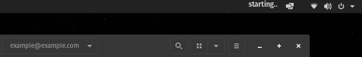
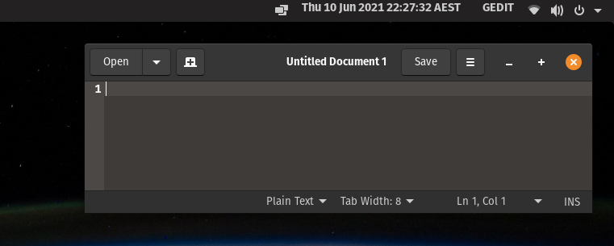
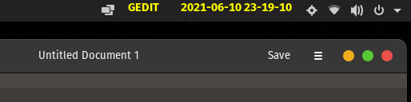

# How to Create a GNOME Extension

See:
* [How to Create GNOME Extension](https://www.youtube.com/watch?v=iMyR5lJf7dU&list=PLr3kuDAFECjZhW-p56BoVB7SubdUHBVQT) by Just Perfection on YouTube
* https://www.codeproject.com/Articles/5271677/How-to-Create-A-GNOME-Extension

Documentation:
* [GNOME Shell Extensions](https://gjs.guide/extensions/)

I think it is only possible to write these extensions using JS.

## 01. Create a Button in Panel

Go to `~/.local/share/gnome-shell/extensions`

Create folder: `example@example.com` (this is the name of the extension)

Create files:
* `metadata.json`:
  * You can check your gnome shell version using: `gnome-shell --version`
* `extension.js`:
  * Import St for UI elements such as buttons
  * Import Main for UI elements such as panels
* `stylesheet.css`
  * We'll look at this later

```js
const St = imports.gi.St
const Main = imports.ui.main
let panelButton, panelButtonText;

function init() {
  panelButton = new St.Bin({ style_class : "panel-button" })
  panelButtonText = new St.Label({ style_class : "examplePanelText", text : "starting..." })
  panelButton.set_child(panelButtonText)
}
function enable() {
  Main.panel._rightBox.insert_child_at_index(panelButton, 1)
}
function disable() {
  Main.panel._rightBox.remove_child(panelButton)
}
```

You can create a GNOME Extension with a PanelButton on the _leftBox, _rightBox, _centerBox, etc.

To load the extension:
1. You may need to reload the GNOME shell (`alt+F2`, and type `r` in the dialog box)
2. Open GNOME Tweaks or the Extensions application
3. Enable your extension



Cool!

## 02. Terminal Commands and Loops

## Loops

We can create a loop using Mainloop:
```js
const Mainloop = imports.mainloop
// ...
let timeout
let counter = 0
function setPanelButtonText(){
    counter++
    panelButtonText.set_text( counter.toString() )
    return true
}
// ...
function enable() {
  timeout = Mainloop.timeout_add_seconds(1.0, setButtonText)
  // ...
}
function disable() {
  Main.panel._rightBox.remove_child(panelButton)
  // ...
}
```
We add a timeout which runs after 1 second and the function return true so it runs again.

Now if we reload our extension, we can see a timer that ticks up.

## Terminal commands

We can run commands using `GLib.spawn_command_line_sync`
```js
// ...
const GLib = imports.gi.GLib

function setButtonText(){
  var arr = []
  // Get date
  var [ok, out, err, exit] = GLib.spawn_command_line_sync('date')
  arr.push( out.toString().replace('\n', '') )

  // Get PID of gedit (text editor) process, so we know if it is open
  var [ok, out, err, exit] = GLib.spawn_command_line_sync('pgrep gedit')
  if (out.length > 0) {
    arr.push('GEDIT')
  }

  // Add text to panel
  panelButtonText.set_text( arr.join('         ') )
  return true
}
```



To include piping, we need to use `/bin/bash -c "foo | bar"`:

We can get the date by JS or GLib. Glib is preferred:
```js
var now = GLib.DateTime.new_now_local()
arr.push(now.format("%Y-%m-%d %H-%M-%S"))
```

## Simple styling

We have added `style_class` to our components in JavaScript, we can now style them using CSS:
```css
.examplePanelText {
    color: yellow;
    height: 100%;
    padding: 3px;
    /*background-color: red;*/
}
```

